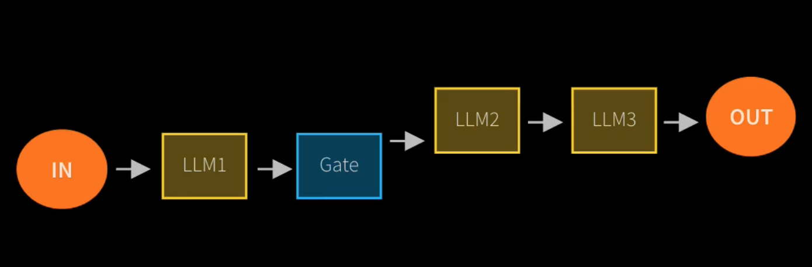
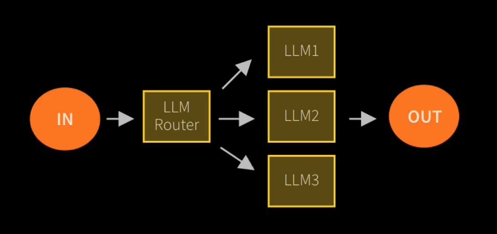
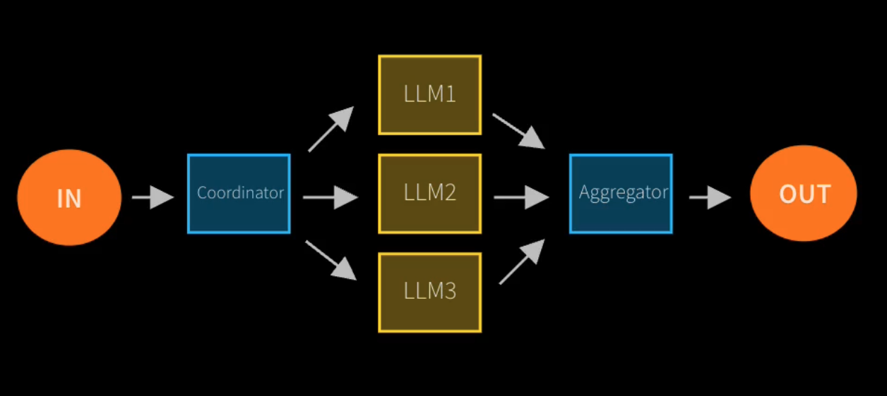
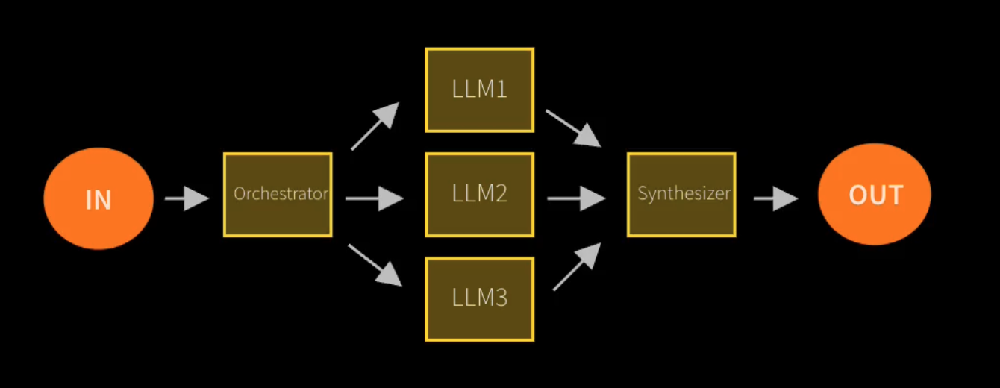
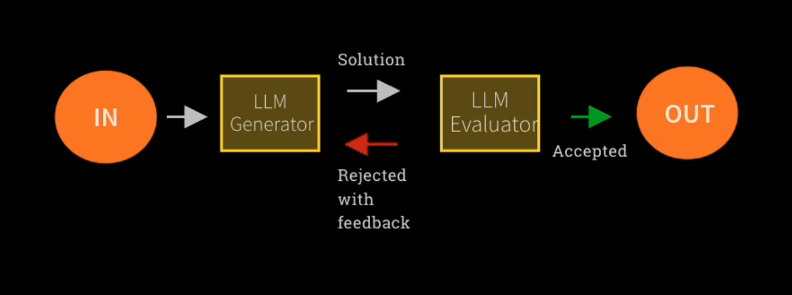
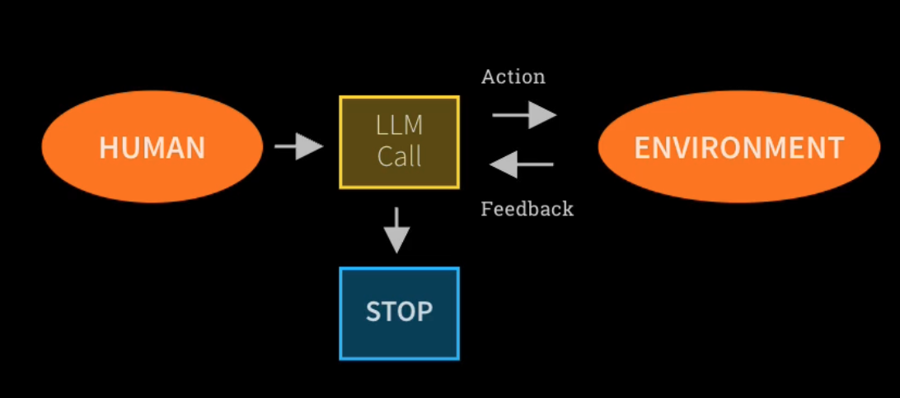
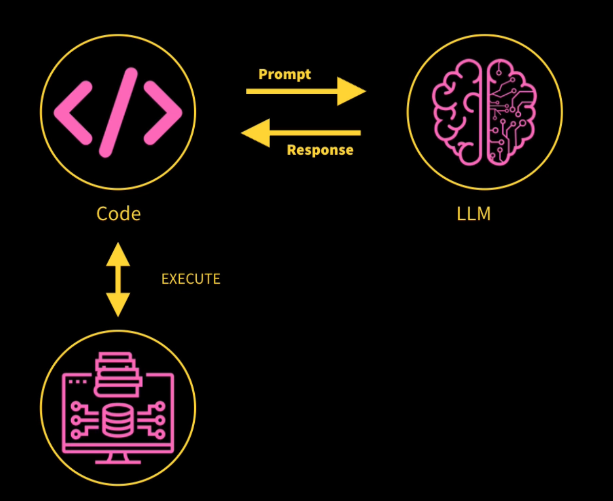

# Foundations

## AI Agents

AI Agents are programs where LLM outputs control the workflow. In practice, describes an AI solution that involves any or all of these:
1. Multiple LLM calls
2. LLMs with ability to use Tools
3. An environment where LLMs interact
4. A Planner to coordinate activities
5. Autonomy

## Agentic Systems

Anthropic distinguishes two types: 
- **Workflows** are systems where LLMs and tools are orchestrated through predefined code paths
- **Agents** are systems where LLMs dynamically direct their own processes and tool usage, maintaining control over how they accomplish tasks

## 5 Workflow Design Patterns

1. **Prompt Chaining**: Decompose into fixed sub-tasks

2. **Routing**: Direct an input into a specialized sub-task ensuring separation of concerns

3. **Parallelization**: Breaking down tasks and running multiple subtasks concurrently

4. **Orchestrator-Worker**: Complex tasks are broken down dynamically and combined

> The key difference between **Parallelization** and **Orchestrator-Worker** is that **Code** breaks down the complex task in Parallelization, while an **LLM** breaks down the complex task in Orchestrator-Worker.

5. **Evaluator-Optimizer**: LLM output is validated by another

## Agent Pattern

1. Open-ended
2. Feedback loops
3. No fixed path

## Risks of Agent Frameworks

- Unpredictable path
- Unpredictable output
- Unpredictable costs

### Mitigations

- Monitor continuously
- Guardrails ensure your agents behave safely, consistently, and within your intended boundaries

## Agentic AI Frameworks (Low to High complexity)

1. No Framework, MCP (Model Context Protocol)
2. OpenAI Agents SDK, Crew AI
3. LangGraph, AutoGen

## Resources vs Tools

Two ways to enhance LLM capabilities
- **Resources**
    - We can provide an LLM with resources to improve its expertise.
    - Basically, this just means shoving data relevant to the question into the prompt.
    - There are techniques like RAG to get really smart at picking relevant content
- **Tools** (give LLMs autonomy):
    - Give an LLM the power to carry out actions like query a database or message other LLMs.
    

